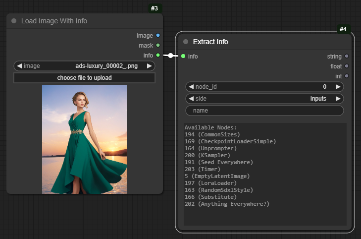
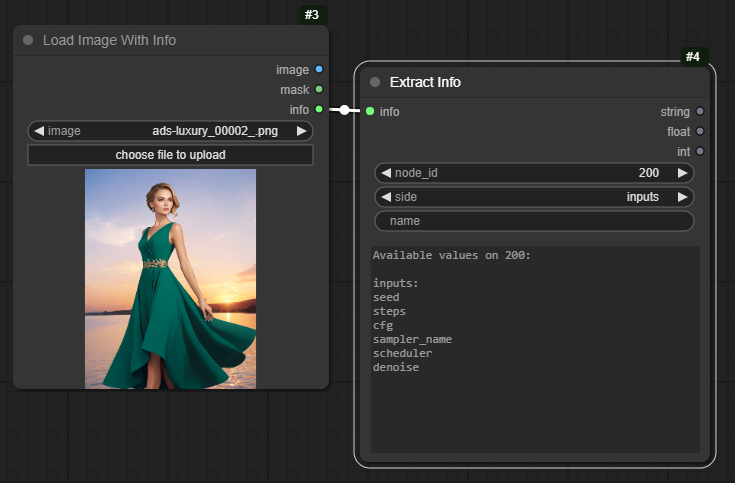
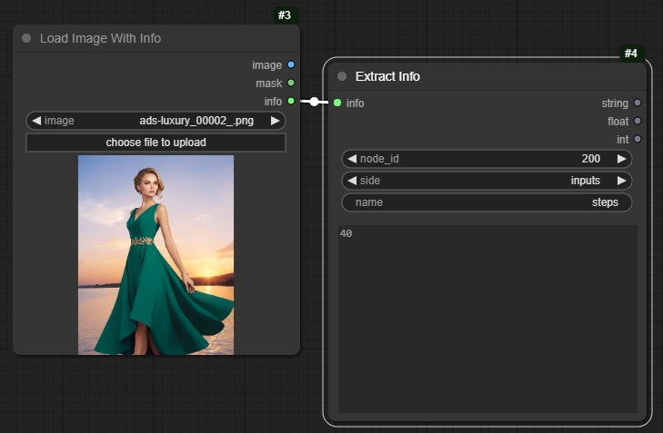
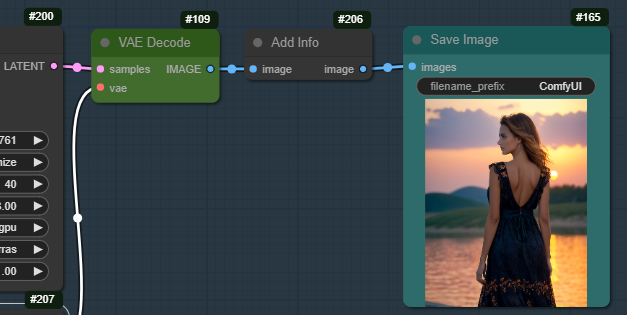
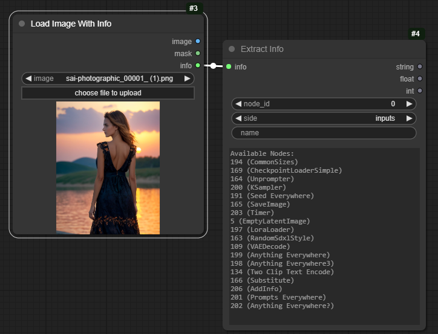
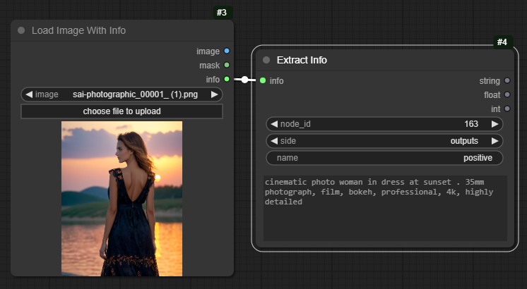
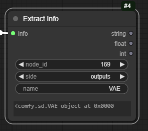

# Prompt Info

A set of three nodes to help retrieve information from previously generated images.

To install:
```
cd [comfy]/custom_nodes
git clone https://github.com/chrisgoringe/cg-prompt-info
```

Leave a star if you like these nodes - and [add an issue](https://github.com/chrisgoringe/cg-prompt-info/issues) if you have problems or ideas.

## Basic idea

Everyone knows that the workflow gets saved into an image saved by ComfyUI so you can just drop the image into a ComfyUI window to recreate the workflow that produced it. That's cool. Great feature.

But sometimes I don't want the whole workflow - I just want to know what prompt I used, or what checkpoint, or LoRA, or whatever.

That's where the first two nodes come in. Load an image using the `Load Image With Info` node, and you get an extra output, called `info`. Plug that into the `Extract Info`, and run:

|You get a list of nodes from the original workflow with information available|Pick one, and you get a list of input and output* values|Pick one, and see what it was|
|-|-|-|
||||

The outputs of the `Extract Info` node contain the displayed value as a string, and, if it can be parsed, as a float and an int - so you can use the values you've extracted.

## *Adding more info

You'll quickly notice that only input values are available, and then only if they were widgets (not inputs). That's all that's stored in the prompt - it's all Comfy needed to do the run. But what if the prompt depended on external files that might have changed, or used random numbers? Or had some really complicated flow so it's hard to get the information you want?

That's the point of the third node. It adds extra data when you save. Get into the habit of using it, you can thank me later.

|Put it just before you save the image, and it adds all the output values of every node that has already been executed|So there's data on a lot more nodes|Including outputs|
|-|-|-|
||||

## What's stored?

Obviously lots of the node outputs contain big python objects representing checkpoints, images, latents etc.. They aren't stored, only STRING, INT or FLOAT values are (strictly, it's anything represented by a python `str`, `int`, or `float`, which might include some other stuff - who knows?). In other cases, what you get is the first 30 characters of the string representation, which is normally enough to tell you what the thing was...



## Update and uninstall

To update:
```
cd [comfy]/custom_nodes/cg-prompt-info
git pull
```

To remove, delete `[comfy]/custom_nodes/cg-prompt-info` and `[comfy]/web/extensions/cg_prompt_info`. Yeah, underscores in that last one.

# Shameless Plug

|Check out [Image Picker](https://github.com/chrisgoringe/cg-image-picker), a node that lets you pause the flow, choose an image from a batch, and send it into the rest of the flow|And [Use Everywhere](https://github.com/chrisgoringe/cg-use-everywhere) nodes to broadcast data invisibily, eliminating the need for lots of connection spaghetti|
|-|-|
|||

